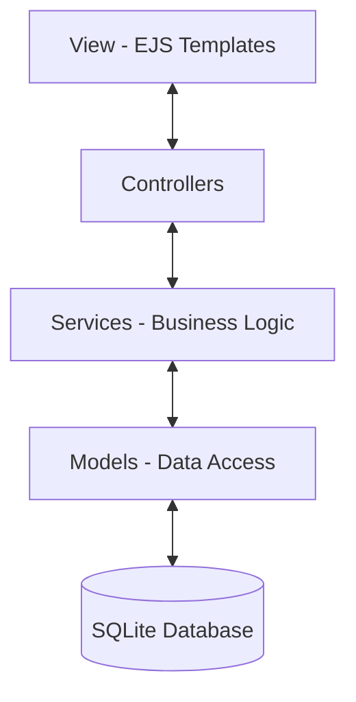

# New Order - Sistema de Gestión de Pedidos


## Descripción del Proyecto

**New Order** es un sistema integral de gestión de pedidos diseñado bajo estándares de alta ingeniería de software. Originalmente concebido como un prototipo académico para la materia **Ingeniería del Software I**, ha evolucionado hacia una plataforma robusta que implementa un **Monolito Modular** con una separación clara de responsabilidades.

El sistema permite la gestión completa del ciclo de vida de una orden: desde la exploración de productos categorizados dinámicamente hasta la autenticación segura y el checkout con gestión geográfica precisa.

---

## Características Principales

### Seguridad y Autenticación
- **Local Auth System:** Implementación de registro y login con hashing de contraseñas mediante `bcryptjs`.
- **Session Management:** Persistencia de sesiones en base de datos (`connect-sqlite3`) para una experiencia de usuario fluida.
- **Role-Based Logic:** Diferenciación entre Roles de Administrador y Cliente.

### Catálogo Dinámico e Inteligente
- **Categorización Flexible:** Productos organizados por categorías (Tecnología, Moda, Deportes, etc.) cargadas dinámicamente.
- **Sidebar Cart:** Carrito de compras reactivo embebido en el header (Partial View) accesible desde cualquier punto de la aplicación.
- **Stock Control:** Validación de inventario en tiempo real.

### Gestión Geográfica y Logística
- **Gestión de Direcciones:** Estructura normalizada para envíos precisos.
- **Métodos de Pago y Envío:** Soporte configurable para múltiples pasarelas y proveedores logísticos.

---

## Arquitectura del Sistema

El proyecto implementa una **Arquitectura Multicapa** siguiendo el patrón **MVC (Model-View-Controller)** dentro de un esquema de **Monolito Modular**.

### Diagrama de Capas



### Estructura de Directorios
```text
src/
├── controllers/    # Controladores de flujo (Auth, Products, Cart)
├── database/       # Configuración e inicialización de SQLite (DDL/DML)
├── models/         # Definición de esquemas y lógica de persistencia
├── public/         # Assets estáticos (CSS, JS Cliente, Imágenes)
├── routes/         # Definiciones de endpoints modulares
├── services/       # El NÚCLEO: Lógica de negocio pura
├── views/          # Templates dinámicos (EJS)
│   ├── auth/       # Vistas de registro y login
│   ├── partials/   # Componentes reutilizables (Header, Footer, Cart)
└── app.js          # Punto de entrada y configuración de Middleware
```

---

## Diseño de Base de Datos (DER)

El sistema ha sido adaptado íntegramente a un modelo relacional de **12 tablas**, garantizando la normalización y escalabilidad de los datos.

| Módulo | Tablas Relacionadas |
| :--- | :--- |
| **Usuarios** | `usuario`, `rol`, `direccion` |
| **Geografía** | `pais`, `provincia`, `localidad` |
| **Catálogo** | `producto`, `categoria` |
| **Ventas** | `pedido`, `detalle_pedido`, `metodo_pago`, `metodo_envio` |

---

## Stack Tecnológico

- **Runtime:** Node.js (v18+)
- **Framework Web:** Express.js 5
- **Motor de Plantillas:** EJS (Embedded JavaScript)
- **Persistencia:** SQLite 3 con filtrado de seguridad
- **Seguridad:** BCrypt.js & Express-Session
- **Estilos:** Modern Vanilla CSS con Custom Properties

---

## Instalación y Uso

### Preferibles
1.  **Clonar el repositorio:**
    ```bash
    git clone https://github.com/jcsa87/new-order.git
    cd new-order
    ```
2.  **Instalar dependencias:**
    ```bash
    npm install
    ```
3.  **Ejecutar en Desarrollo (con hot-reload):**
    ```bash
    npm run dev
    ```

El sistema inicializará automáticamente la base de datos `database.db` y realizará el *seeding* de datos iniciales si no existen.

**Acceso Local:** `http://localhost:3000`

---
*Este proyecto es parte de la formación académica en Ingeniería de Software. 
Desarrollado por Senicen Acosta, Juan Cruz y Ramos, Arianda Milagros. 2026*
