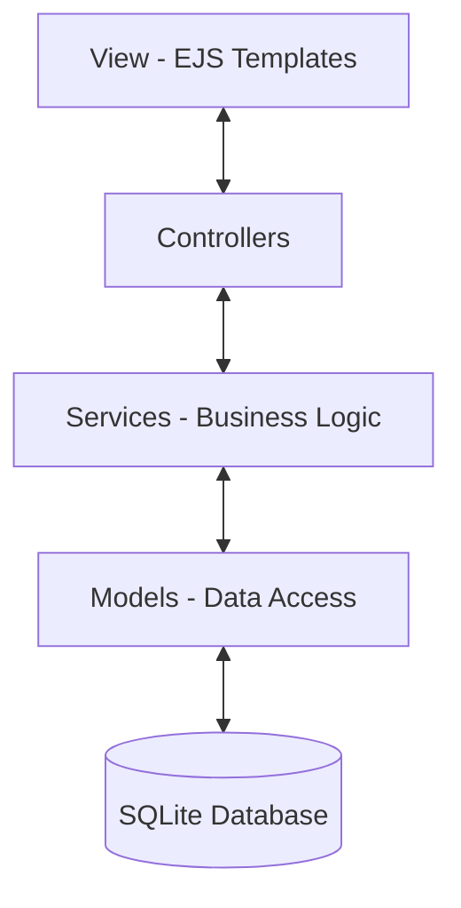

# New Order - Sistema de Gestión de Pedidos


## Descripción del Proyecto

New Order es un sistema integral de gestión de pedidos diseñado bajo estándares de alta ingeniería de software. Originalmente concebido como un prototipo académico para la materia Ingeniería del Software I, ha evolucionado hacia una plataforma robusta que implementa un Monolito Modular con una separación clara de responsabilidades y un enfoque en la mantenibilidad.

El sistema permite la gestión completa del ciclo de vida de una orden: desde la exploración de productos categorizados dinámicamente hasta la autenticación segura y el proceso de checkout.

---

## Características Principales

### Seguridad y Autenticación
- Local Auth System: Implementación de registro y login con hashing de contraseñas mediante bcryptjs.
- Session Management: Persistencia de sesiones en base de datos (connect-sqlite3) para una experiencia de usuario fluida y segura.
- Role-Based Logic: Diferenciación lógica entre Roles de Administrador y Cliente.

### Catálogo Dinámico e Inteligente
- Categorización Flexible: Productos organizados por categorías cargadas dinámicamente desde la base de datos.
- Sidebar Cart: Carrito de compras interactivo embebido en la interfaz global.
- Stock Control: Validación rigurosa de inventario en tiempo real durante la selección y actualización de productos.

### Gestión Geográfica y Logística
- Normalización de Direcciones: Estructura de datos para envíos precisos basada en País, Provincia y Localidad.
- Métodos de Pago y Envío: Soporte extensible para múltiples pasarelas y proveedores logísticos.

---

## Arquitectura del Sistema

El proyecto implementa una Arquitectura Multicapa siguiendo el patrón MVC (Model-View-Controller) dentro de un esquema de Monolito Modular.

### Contratos de Operación
Se ha implementado una lógica de servicios basada en contratos claros para la gestión de datos, especialmente en el módulo de compras:
- Listar Productos: Recuperación eficiente de ítems del catálogo.
- Agregar Ítem: Validación de stock y consistencia antes de la inserción.
- Actualizar Cantidad: Recálculo automático de subtotales, impuestos y totales.

### Diagrama de Capas



### Estructura de Directorios
```text
src/
├── controllers/    # Controladores de flujo y orquestación
├── database/       # Configuración e inicialización de SQLite (DDL/DML)
├── models/         # Definición de esquemas y lógica de persistencia
├── public/         # Assets estáticos (CSS, JS Cliente, Imágenes)
├── routes/         # Definiciones de endpoints modulares
├── services/       # Núcleo: Lógica de negocio y servicios
├── views/          # Templates dinámicos (EJS)
│   ├── auth/       # Vistas de registro y login
│   ├── partials/   # Componentes reutilizables (Header, Footer, Cart)
└── app.js          # Punto de entrada y configuración de Middleware
```

---

## Diseño de Base de Datos (DER)

El sistema utiliza un modelo relacional de 12 tablas, garantizando la integridad referencial y la escalabilidad de la información.

| Módulo | Tablas Relacionadas |
| :--- | :--- |
| Usuarios | usuario, rol, direccion |
| Geografía | pais, provincia, localidad |
| Catálogo | producto, categoria |
| Ventas | pedido, detalle_pedido, metodo_pago, metodo_envio |

---

## Stack Tecnológico

- Runtime: Node.js (v18+)
- Framework Web: Express.js 5
- Motor de Plantillas: EJS (Embedded JavaScript)
- Persistencia: SQLite 3 con filtrado de seguridad
- Seguridad: BCrypt.js y Express-Session
- Estilos: Modern Vanilla CSS con Variables CSS (Custom Properties)

---

## Instalación y Uso

1. Clonar el repositorio:
   ```bash
   git clone https://github.com/jcsa87/new-order.git
   cd new-order
   ```

2. Instalar dependencias:
   ```bash
   npm install
   ```

3. Ejecutar en Desarrollo:
   ```bash
   npm run dev
   ```

El sistema inicializará automáticamente la base de datos database.db y realizará la carga de datos iniciales si la base de datos está vacía.

Acceso Local: http://localhost:3000

---
Este proyecto es parte de la formación académica en Ingeniería de Software.
Desarrollado por Senicen Acosta, Juan Cruz y Ramos, Aridna Milagros. 2026
